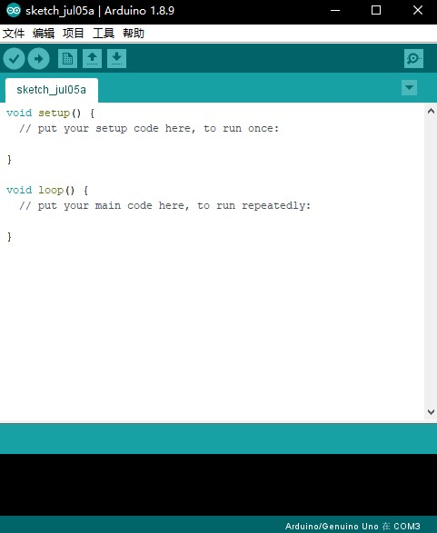
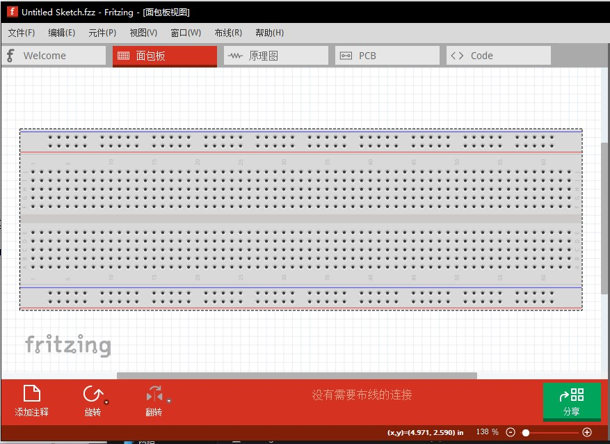
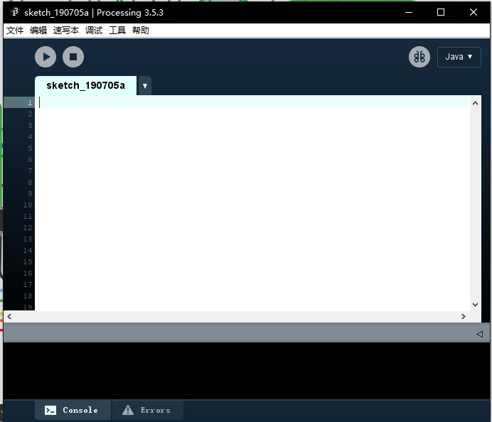
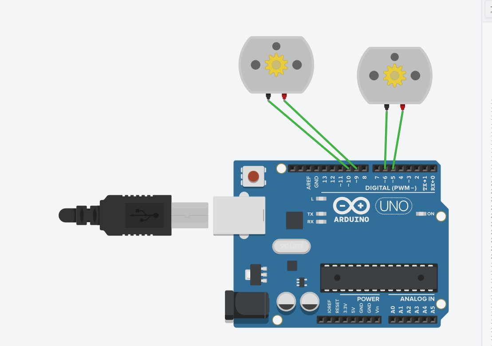
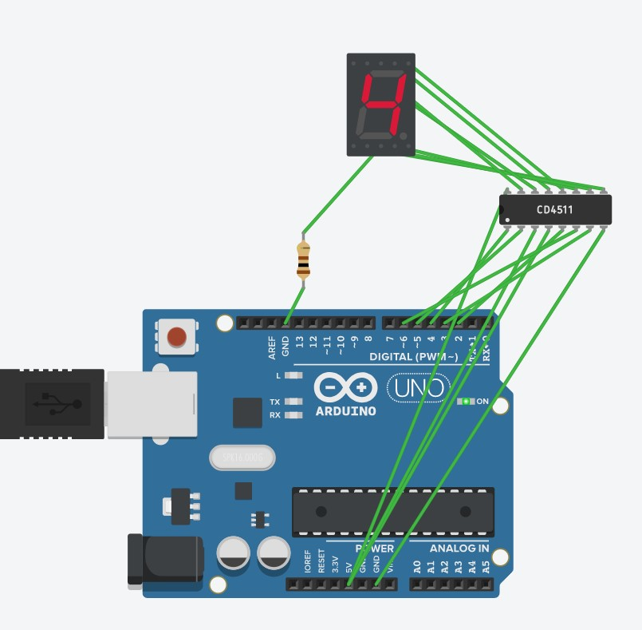
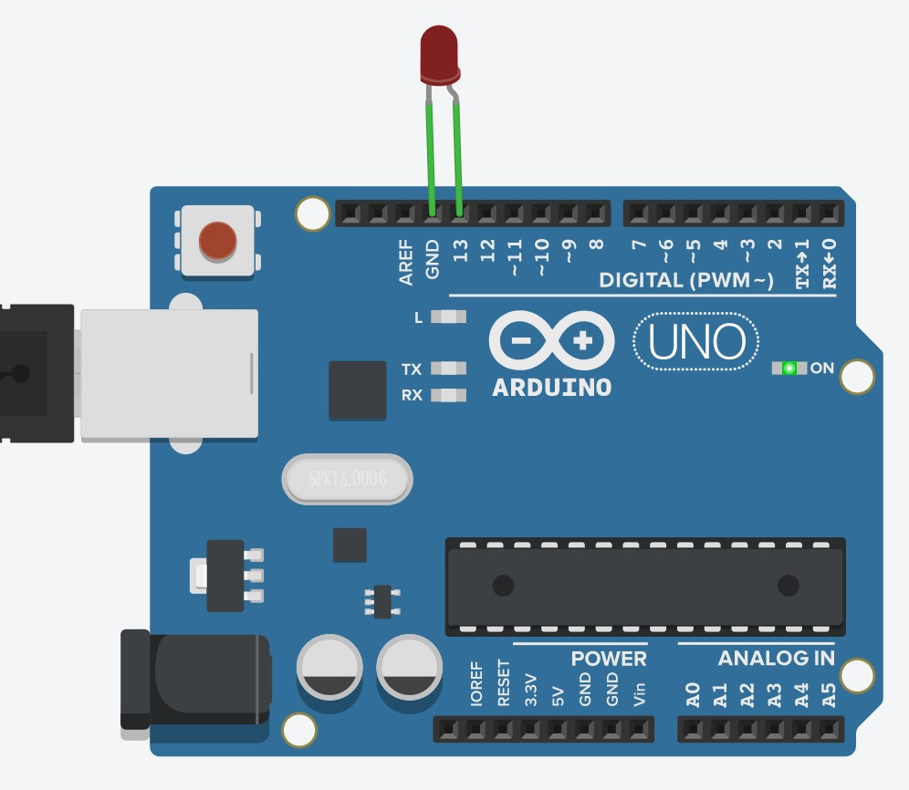
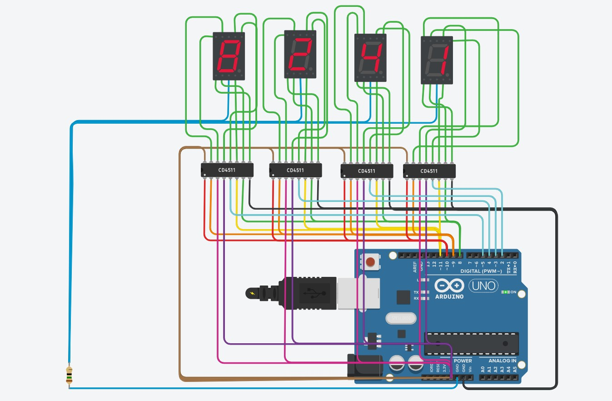

# 开源硬件设计
>蒋思成

## 第一天
#### 学习内容
    如何学习开源硬件    
    几个常用的网站  
    三个软件的安装
arduino



fritzing



processing



[Arduino](https://www.arduino.cc/)

[Fritzing](http://fritzing.org/home/)

[Processing](https://processing.org/)

## 第二天
Morse.h
```c
#ifndef _MORSE_H
#define _MORSE_H
class Morse
{
    public:
        Morse(int pin);
        void dot();
        void dash();
        void c_space();
        void w_space();
        void s_space();
    private:
        int _pin;
        int _dottime;
};
#endif /*_MORSE_H*/
Morse.cpp
#include "Arduino.h"
#include "Morse.h"
Morse::Morse(int pin)
{
    pinMode(pin,OUTPUT);
    _pin=pin;
    _dottime=250;
}
void Morse::dot()
{
    digitalWrite(_pin,HIGH);
    delay(_dottime);
    digitalWrite(_pin,LOW);
    delay(_dottime);
}
void Morse::dash()
{
    digitalWrite(_pin,HIGH);
    delay(_dottime*4);
    digitalWrite(_pin,LOW);
    delay(_dottime);
}
void Morse::c_space()
{
    digitalWrite(_pin,LOW);
    delay(_dottime*2);
}
void Morse::w_space()
{
    digitalWrite(_pin,LOW);
    delay(_dottime*6);
}
void Morse::s_space()
{
    digitalWrite(_pin,LOW);
    delay(_dottime*10);
}
Mrose.ino
#include <Morse.h>
Morse morse(13);
//定义一个数字存储每个字母的摩尔斯码
char a[26][4] = {
  {'.','-','*','*'},//A
  {'-','.','.','.'},//B
  {'-','.','-','.'},//C
  {'-','.','.','*'},//D
  {'.','*','*','*'},//E
  {'.','.','-','.'},//F
  {'-','-','.','*'},//G
  {'.','.','.','.'},//H
  {'.','.','*','*'},//I
  {'.','-','-','-'},//J
  {'-','.','-','*'},//K
  {'.','-','.','.'},//L
  {'-','-','*','*'},//M
  {'-','.','*','*'},//N
  {'-','-','-','*'},//O
  {'.','-','-','.'},//P
  {'-','-','.','-'},//Q
  {'.','-','.','*'},//R
  {'.','.','.','*'},//S
  {'-','*','*','*'},//T
  {'.','.','-','*'},//U
  {'.','.','.','-'},//V
  {'.','-','-','*'},//W
  {'-','.','.','-'},//X
  {'-','.','-','-'},//Y
  {'-','-','.','.'} //Z
};
void setup() 
{
  //打开串口
  Serial.begin(9600);
}
void loop()
{
  if (Serial.available() > 0)//判断是否有输入
  {
    int i = Serial.read();
    if (i>=97 && i<=122)//判断是否为字母
    {
      i -= 97;
      //根据摩尔斯码调用库函数控制led闪烁
      for (int j=0; j<4; ++j)
      {
        if (a[i][j]=='.')
            morse.dot();
        else if (a[i][j]=='-')
            morse.dash();
      }
      morse.c_space();//字符间的间隔
    }
    else if (i == 32)
        morse.w_space();//读取到空格时单词间的间隔
    else
        morse.s_space();//读取到回车时句子间的间隔
  }
}
```
## 第三天
小车电路图

```c
void setup()
{
  pinMode(9, OUTPUT);
  pinMode(10, OUTPUT);
  pinMode(5, OUTPUT);
  pinMode(6, OUTPUT);
  Serial.begin(9600);
}
int income = 0;
void loop()
{
  if (Serial.available()>0)
  {
    income = Serial.read();
  }
  switch(income)
  {
    case 'f':
        forward();
        break;
    case 'b':
        backward();
        break;
    case 'l':
        left();
        break;
    case 'r':
        right();
        break;
    case 's':
        stop();
        break;
    default:
        break;
  }
}
void forward()
{
  digitalWrite(5, HIGH);
  digitalWrite(6, LOW);
  digitalWrite(9, HIGH);
  digitalWrite(10, LOW);
}
void backward()
{
  digitalWrite(6, HIGH);
  digitalWrite(5, LOW);
  digitalWrite(10, HIGH);
  digitalWrite(9, LOW);
}
void left()
{
  digitalWrite(5, HIGH);
  digitalWrite(6, LOW);
  digitalWrite(10, HIGH);
  digitalWrite(9, LOW);
}
void right()
{
  digitalWrite(6, HIGH);
  digitalWrite(5, LOW);
  digitalWrite(9, HIGH);
  digitalWrite(10, LOW);
}
void stop()
{
  digitalWrite(5, LOW);
  digitalWrite(6, LOW);
  digitalWrite(9, LOW);
  digitalWrite(10, LOW);
}
```
数码管





代码
```c
void setup()
{
  pinMode(2, OUTPUT);
  pinMode(3, OUTPUT);
  pinMode(4, OUTPUT);
  pinMode(5, OUTPUT);
  pinMode(6, OUTPUT);
  Serial.begin(9600);
}
byte income=0;
void loop()
{
  if(Serial.available()>0)
  {
    income = Serial.read();
    income = income - '0';
    digitalWrite(2,LOW);
    delay(10);
    if(income & 0x1)
    {
      digitalWrite(3,HIGH);
    }
    else
    {
      digitalWrite(3,LOW);
    }
    if((income>>1) & 0x1)
    {
      digitalWrite(4,HIGH);
    }
    else
    {
      digitalWrite(4,LOW);
    }
    if((income>>2) & 0x1)
    {
      digitalWrite(5,HIGH);
    }
    else
    {
      digitalWrite(5,LOW);
    }
    if((income>>3) & 0x1)
    {
      digitalWrite(6,HIGH);
    }
    else
    {
      digitalWrite(6,LOW);
    }
    delay(10);
    digitalWrite(2,HIGH);
    delay(10);
  }
}
```
## 第四天
morse2

```c
#include "Arduino.h"
int _pin;
int _dottime;
void init(int pin)
{
  pinMode(pin,OUTPUT);
  _pin = pin;
  _dottime = 250;
}
void dot()
{
  digitalWrite(_pin,HIGH);
  delay(_dottime);
  digitalWrite(_pin,LOW);
  delay(_dottime);
}
void dash()
{
  digitalWrite(_pin,HIGH);
  delay(_dottime*4);
  digitalWrite(_pin,LOW);
  delay(_dottime);
}
void c_space()
{
  digitalWrite(_pin,LOW);
  delay(_dottime*3);
}
void w_space()
{
  digitalWrite(_pin,LOW);
  delay(_dottime*7);
}
void s_space()
{
  digitalWrite(_pin,LOW);
  delay(_dottime*10);
}
char a[][4] = {
{'.','-','*','*'},//A
{'-','.','.','.'},//B
{'-','.','-','.'},//C
{'-','.','.','*'},//D
{'.','*','*','*'},//E
{'.','.','-','.'},//F
{'-','-','.','*'},//G
{'.','.','.','.'},//H
{'.','.','*','*'},//I
{'.','-','-','-'},//J
{'-','.','-','*'},//K
{'.','-','.','.'},//L
{'-','-','*','*'},//M
{'-','.','*','*'},//N
{'-','-','-','*'},//O
{'.','-','-','.'},//P
{'-','-','.','-'},//Q
{'.','-','.','*'},//R
{'.','.','.','*'},//S
{'-','*','*','*'},//T
{'.','.','-','*'},//U
{'.','.','.','-'},//V
{'.','-','-','*'},//W
{'-','.','.','-'},//X
{'-','.','-','-'},//Y
{'-','-','.','.'} //Z
};
void setup() 
{
  init(13);
  Serial.begin(9600);
}
void loop()
{
  if (Serial.available() > 0)
  {
    int i = Serial.read();
    if (i>=97 && i<=122)
    {
      i -= 97;
      for (int j=0; j<4; ++j)
      {
        if (a[i][j]=='.')
            dot();
        else if (a[i][j]=='-')
            dash();
      }
      c_space();
    }
    else if (i == 32)
        w_space();
    else
        s_space();
  }
}
```
不同数字显示

```c
void setup()
{
  pinMode(2, OUTPUT);
  pinMode(3, OUTPUT);
  pinMode(4, OUTPUT);
  pinMode(5, OUTPUT);
  pinMode(6, OUTPUT);
  Serial.begin(9600);
}
byte income=0;
void loop()
{
  if(Serial.available()>0)
  {
    income = Serial.read();
    income = income - '0';
    digitalWrite(2,LOW);
    delay(10);
    if(income & 0x1)
    {
      digitalWrite(3,HIGH);
    }
    else
    {
      digitalWrite(3,LOW);
    }
    if((income>>1) & 0x1)
    {
      digitalWrite(4,HIGH);
    }
    else
    {
      digitalWrite(4,LOW);
    }
    if((income>>2) & 0x1)
    {
      digitalWrite(5,HIGH);
    }
    else
    {
      digitalWrite(5,LOW);
    }
    if((income>>3) & 0x1)
    {
      digitalWrite(6,HIGH);
    }
    else
    {
      digitalWrite(6,LOW);
    }
    delay(10);
    digitalWrite(2,HIGH);
    delay(10);
  }
}
```
## 总结
- 经过四天的学习，对arduino开发有了一定的了解，嵌入式开发是计科的四个方向之一，也是唯一一个硬件方向，由于种种原因不太热门。但是经过实践发现，相较软件方向，硬件需求更多的实物操作，更容易得到可视化的明显的成果，易获得成就感。这也是为什么国外很多小孩会进行这方面的学习，对儿童来说趣味性是学习的重要影响因素，而编程语言的学习，即使是python这样方便简单容易做一些小东西的语言，也缺乏趣味性。相反，arduino等的学习则类似于小玩具，很容易激发兴趣，也许更为适合作为儿童接触编程的途径。浙江新高考政策将编程加入高考，前两年使用VB，第三年开始使用python教学。根据我自身学习的经验，很多学生学习编程较为艰难，编程题也缺乏实用性，大多数情况是为出题而出题，大量在实际使用中毫无意义的代码，为了拿分一遍遍的刷题，本质与数学物理无益。三年学习，全部内容不比大一C语言多多少，即便这样，也有很多人会放弃编程题的分数，花费精力在其他题型上。如果使用arduino这样主要实践的方式作为学习工具，也许才更符合新高考改革的初衷。
- 第一天初步了解了arduino的几个软件和基本使用流程以及liunx系统。Github，对专业发展方向有了更深一步的了解。Github的使用是学习编程重要的一环，无论是学习别人的代码还是分享自己的代码，或者是加入开源项目，对自身发展都有很大好处。
- 第二天编写了第一个arduino程序，以摩尔斯码的规则控制led灯的闪烁，这时便可以发现嵌入式编程与桌面开发的不同。嵌入式编程要求将代码写入微小的芯片中，可以使用的内存相对桌面开发很小，因此代码的运行效率成为很重要的一环。反观桌面开发由于硬件的不断进步，更愿意使用较低的运行效率换取开发的便捷和快速，java和python等语言发展火热。而嵌入式几乎只能使用C和C++或效率更为极致的汇编语言进行开发，虽然也有java的使用也在增多，但不能动摇C语言的地位。而在arduino软件在也会在每次编译后提醒你占用了多少空间，还可以使用多少，这是一种全新的体验。代码的编写倒是没有太大差异，感觉类似于学了一种新的框架。
- 第三天编写的小车和数码显像管体现出了硬件和软件的又一个不同，便是延时的问题。arduino串口可能出现的来不及接收数据，来不及改变串口电位的现象在软件中一般见不到，在硬件中就必须考虑其带来的影响，设置合适的延时确保按照规划进行。同时还有元器件电流极限的问题，在实践中如果贸然接线通电进行尝试，很可能会烧毁元器件，必须做更多的考虑，而不是写完代码，做到“理论上没问题”就可以去尝试。
- 第四天了解到硬件中没有java等语言中的多线程的概念，但通过硬件的方式，也可以实现类似于线程锁的效果，来完成一些需要“多线程”的操作。其实很多通过软件实现的效果是可以通过硬件实现的，但是软件的方式更为简单，这也是为什么软件比硬件更热门吧，人们更倾向于写一个驱动而不是改造硬件来实现效果。
- 时间虽然短暂，也算粗略的了解了嵌入式的概念，在以后的专业课中也许会有更深入的接触，即使不走这个方向，对硬件的了解也有利于代码的编写。
